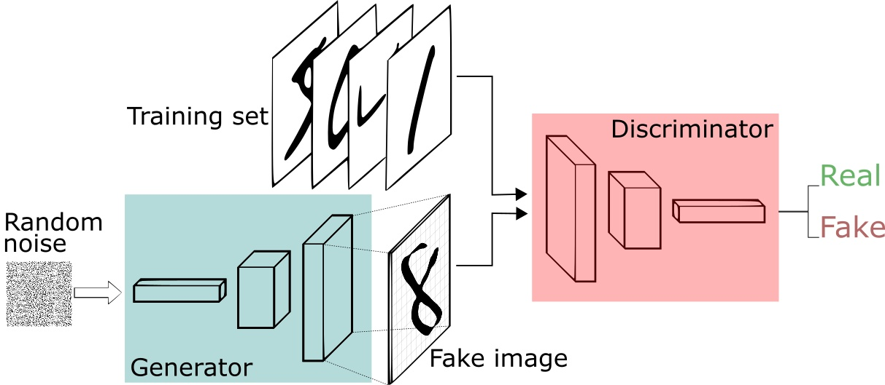

# [(2020 CCS)Cyber-Physical Inconsistency Vulnerability Identification for Safety Checks in Robotic Vehicles](https://dl.acm.org/doi/pdf/10.1145/3372297.3417249)
## 1 Summary
In this paper, the author identified a new type of vulnerability for robotic vehicles, the cyber-physical inconsistency. The author explained the reason why this vulnerability happens is that the inherent linear of the control problems widely used in robotic vehicles.  After analyzing the cause of this phenomenon, the author a novel method that uses simulation and objective functions two find the scenarios where this vulnerability happen.  
With the simulation result, the author also conducted real-world experiments and identified several real cp-inconsistency. 
## 2 Challenge
The main challenge this research faces is that how to judge the cp-inconsistency happens. To solve this problem, the other uses program analysis and system identification to construct two objective functions.  
Another challenge reside in what can we do to identify a specific event happens in the simulation environment. The author proposed a resolution by using a virtual RV that runs parallel with the real RV.
## 3 Main Idea
### 3.1 Overview

The picture above shows the overall process to identify cp-inconsistency. First, In the upper-left corner, a program analysis method is used to analyze the source code of the control program to find condition statements related to the processing function of a specific event such as the crash of a UAV. Second, in the lower-left corner, a system identification(SI) process makes use of operation traces and a model template to derive a state-space model. The model represents the virtual RV. The loop in the middle describe the procedure of search-based evolutionary testing procedure to find CP-inconsistency.
### 3.2 Cyber Cost Function
In the simulation the cyber cost function is used to judge whether a particular event is detected. The attacker is assumed to have access to the source code of the control program and thus can get the function name of the corresponding action. Then a static program analyze is used to find all predicts from the control loop to the function. The cost function and constraints are then produced by expressed these predicts in mathematical expressions.

### 3.3 Physical Cost
The physical cost function describes how much difference between the state of virtual RV and RV is virtual test field. To generate sucj formulation, we must understand how to represent the state of virtual RV. The proposed method consider the hybrid model which means that the RV has several operation modes. It depicts each mode with a state-space model which can be considered as a set of equations that compute the next state value using the current state and reference value generated by the trace.  
After constructing the space-state model, the physical cost function can be expressed as the distance of virtual RV and real RV.

### 3.4 Search-Based Evolutionary Test
The goal of the testing is to find maximum/minimum point of cost functions. However traditional gradient based method works badly because the multiple cost functions are non-convex, like the picture shown below.

So the author used a evolutionary algorithm to perform the search process.  
Specifically, the algorithm starts with a set of random test samples that form the first generation. It executes these samples in the simulator and computes the cost function values. Those who have better cost function values(called healthy samples) are selected to derive the next generation. The derivation is through two evolution operations called cross-over and mutation, with the former mixing parts from two parents into a child input and the letter randomly altering values in a parent input to produce a child. The newly derived children and the healthy parents form the next generation. The process repeats until  no better child can be found.

## 4 Strength
1. The newly proposed vulnerability of robotic vehicles, the cyber-physical inconsistency.
2. The design of cost function to find this phenomenon.
3. The pipeline to evaluate the simulation

## 5 Weakness
1. Modern autonomous vehicles typically have deep learning model for perception and localization. Whether the method proposed can be applied to deep learning model is waiting for further validation.

# [(2018 USENIX)6thSense: A Context-aware Sensor-based Attack Detector for Smart Devices](https://www.usenix.org/system/files/conference/usenixsecurity17/sec17-sikder.pdf)
## 1 Solved Problem
The current permission-based sensor management systems in smart devices only focus on particular sensors thus make other sensor vulnerable for various attacks. The attacker can access to these sensors by just using the corresponding API. In this paper the author proposed a context-aware intrusion detection system using machine learning models to enhance the security of smart devices.
## 2 Main Idea
In this paper the author considered three attack models:

* Triggering a malicious APP via a sensor
* Information leakage via a sensor
* Stealing information via a sensor

To deal with these attacks the author proposed 6thSense which contains three main phases:

1. Data collection
2. Data processing
3. Data analysis

In the data collection phase, the author used an APP to collect data from different sensors. The processing phase just execute some operation for analysis. In the data analysis phase, a machine learning model is used to judge whether a malicious access occurred.  
The author tested performance of two different machine learning algorithms:

* Markov Chain
* Naive Bayes
  
For each model, the author train them using data both malicious and normal.

## 3 Highlights Worth Learning
1. Using context-aware method rather than permission-based method.

# [(2014 NIPS)Generative Adversarial Nets](https://proceedings.neurips.cc/paper/2014/file/5ca3e9b122f61f8f06494c97b1afccf3-Paper.pdf)
## 1 Solved Problem
In this paper the author proposed a new generative neural network model using adversarial training performed by a discriminative model. The generative model is used to recover the training data's distribution while the discriminative model is used to evaluate how possible the samples come from the true distribution. The purpose of the train loop is to make the probability of the generative model's output as large as possible in the discriminative model.
## 2 Main Idea
The work flow of the GAN can be illustrated in the picture below:

A random noise distribution is used as the input to the generative model. The role of the generative model is to translate the random distribution to fake data distribution thus generate the fake sample. After the fake sample is generated, a discriminative model is used to distinguish whether the input sample is from the true data distribution. So if we can maximize the output of the discriminative model on the fake sample, we can make the fake sample almost identity to the origin sample.  
The training process first train the discriminative model using data from true distribution and fake distribution. After k iterations, the generative model is trained using the discriminative model. The process continue until converge.

## 3 Highlights Worth Learning
1. The idea that trains a generative model using adversarial process.
2. The novel training method.

