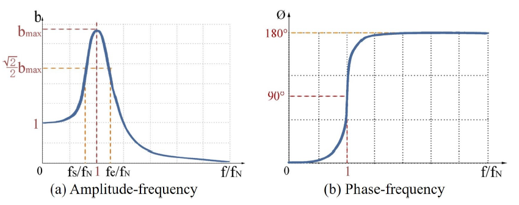
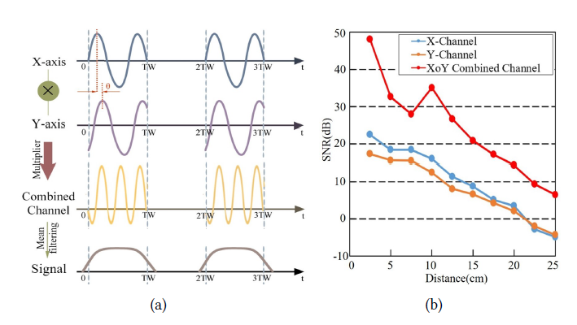
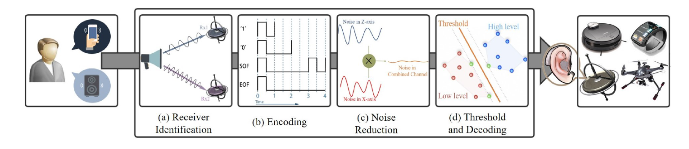
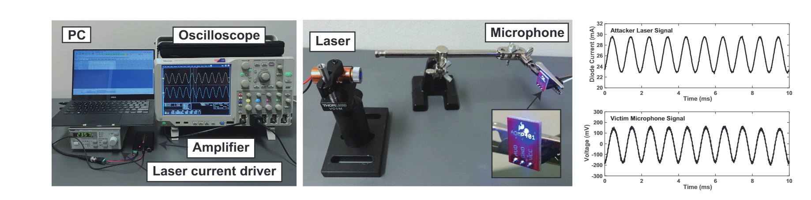

# [(2020 MobiCom)Deaf-Aid: Mobile IoT Communication Exploiting Stealthy Speaker-to-Gyroscope Channel](https://cse.buffalo.edu/~wenyaoxu/papers/conference/xu-mobicom2020c.pdf)

## 1 Summary
The explosive development of IoT devices puts forward a higher demand for the communication technology. Because of the different purpose, there are a lot of existing electromagnetic wave based protocols, such as WiFi and Bluetooth. However, devices using one protocol can't communicate with devices with another protocol, which compromise the connectivity of smart devices. In this paper, the authors focus on the covert channel communication and proposed a communication system based on the resonance of the gyroscope triggered by ultrasound.

## 2 Challenge
The are several works which attempt to build connection via covert channel such as physical vibration. However, such devices all need either expensive device or strict operate condition, such as physical touch. So, the main contribution in this paper is that it proposes a general communication system without the need to modify current devices.  
Furthermore, because the covert channels are not designed originally toward communication, how to build robust communication on these deficient channels is another obstacle.

## 3 Main Idea
### 3.1 Resonance
Previous works have proved that the ultrasound wave can lead the gyroscope to oscillate. Gyroscopes have different responses to ultrasound signal at different frequency. As the picture shown below:

The picture depicts that the amplitude of the vibration obtain the maximum in the nature frequency of the gyroscope, so as to the phase offset. So to improve the accuracy, we should transmit the voice signal as close to the nature frequency as possible.

### 3.2 Device Identification
Previous works on covert channel communication all need the manual identification of devices. Section 3.1 has mentioned that different gyroscopes have different nature frequency, even to the same model. This feature can be used to identify different devices. Specifically, before the system is used, we can take a couple of minutes two measure the nature frequency and send a message to tell the speaker its frequency.

### 3.3 Encoding
In this paper, the authors using the pattern between two continuous rising edge.

As the picture above, the authors encode 1 as shorter interval between two rising edges and 1 as longer interval between two rising edges. Futhermore, it uses longer interval to encode the start and end of the transmission.

### 3.4 Decode

The encoded information is modulated to the carrier with the frequency that is equal to the frequency of the target gyroscope. To decode the information from the received signal, the receiver uses a threshold based algorithm named max entrophy threshold to calculated the threshold. When the intensity of the signal is above the calculated threshold, it is concluded to be a legal bit. The decoder then use the time domain information to determine the semantic of the bit.

### 3.5 Noise Reduction
There are a lot of factors that min compromise the robustness of the transmission.

* The offset induced by the variety of sample rate.
* The motion in both the transmitter and the receiver.
* The noise in the measurement process.

To improve the effect of the system in real, complex world, the authors multiply the output of the two axises and apply a mean filter to it, this can reduce the influence of sample rate offset and motion.

### 3.6 System Overview

The picture below shows the total procedure of the System. At the transmitter side, the information generated by the user is encoded using the above mentioned method as the modulated to the transmission channel. The the commodity speaker is used to generated the ultrasound wave signal. The signal arrive at the receiver and cause the resonance of the gyroscope. After some signal process procedure, the signal is final decoded to the origin information sent by the transmitter.

## 4 Strength

1. Use covert channel communication to avoid the gap between different protocols.
2. The system proposed is robust enough in the motion scenario so it can be used in wearable devices

## 5 Weakness
1. The bandwidth is quite small, which compromise the generality of the system.

# [(2020 USENIX)Light commands: laser-based audio injection attacks on voice-controllable systems](https://www.usenix.org/system/files/sec20-sugawara.pdf)

## 1 Summary

In this paper, the author proposed a novel attack that utilize the response that MEMS microphones make on laser beams to inject malicious signal to them. The authors find that attackers can inject arbitrary signals to the microphones with amplitude modulated laser beam which can lead to misbehavior of most of the commercial voice assistance.

## 2 Main Idea

The authors detect the following attack method.

1. The authors use a oscilloscope to generate based band signal which is converted to laser signal by a laser driver that connect the laser diode and oscilloscope.
2. The authors play a pre-recorded audio file. The wave form of the audio is translated to the signal by amplitude modulation.
3. The laser beam arrive at the MEMS microphone and desirable induce fake output of it.

## 3 Highlights Worth Learning

1. With the using of laser beam as attack vector, the proposed method can much further attack distance compared to traditional voice signal based methods.
2. The MEMS are vulnerable to a lots of physical phenomenon, which can be utilized to launch feasible attack.

# [(2018 AsiaCCS)Sensor CON-Fusion: Defeating Kalman Filter in Signal Injection Attack](https://dl.acm.org/doi/pdf/10.1145/3196494.3196506)

## 1 Summary

Sensor-fusion algorithms has been used widely to improve the robustness of the sensor measurement by combination outputs from a couple of different sensors. However, the sensor-fusion is not designed to increase the security of the sensor initially. So, in this paper, the author investigate the security of sensor fusion algorithm under multiple sensor attacks simultaneously.

## 2 Main Idea

The authors choose the attitude-heading reference systems(AHES) as the target. This system uses kalman filter to fuse outputs from accelerometer, gyroscope and magnetometer. The author categorize the access ability of attackers to three level.
* Control: The attacker can let the sensor to generate desirable signal.
* Disruptive: The attacker can corrupt the input of the sensor.
* Uncontrollable: The attacker can't influence the sensor.

Because there are three levels and three sensors, the authors investigate all of the 27 scenarios using generated data both in stationary and non-stationary condition.

## 3 Highlights Worth Learning

1. Consider the scenario where multiple sensor attacks happens.

