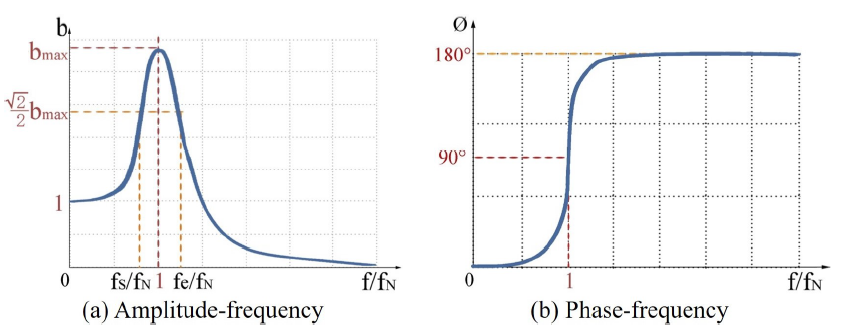
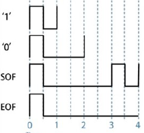
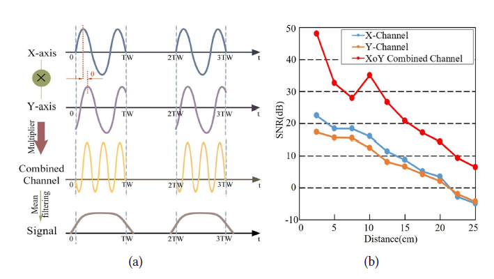
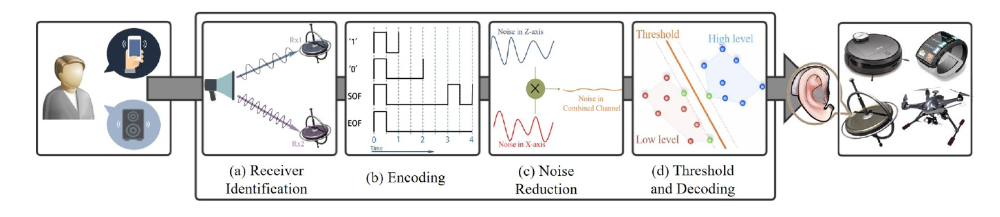

# (2020 MobiCom)Deaf-Aid: Mobile IoT Communication Exploiting Stealthy Speaker-to-Gyroscope Channel

## 1 Summary
The explosive development of IoT devices puts forward a higher demand for the communication technology. Because of the different purpose, there are a lot of existing electromagnetic wave based protocols, such as WiFi and Bluetooth. However, devices using one protocol can't communicate with devices with another protocol, which compromise the connectivity of smart devices. In this paper, the authors focus on the covert channel communication and proposed a communication system based on the resonance of the gyroscope triggered by ultrasound.

## 2 Challenge
The are several works which attempt to build connection via covert channel such as physical vibration. However, such devices all need either expensive device or strict operate condition, such as physical touch. So, the main contribution in this paper is that it proposes a general communication system without the need to modify current devices.  
Furthermore, because the covert channels are not designed originally toward communication, how to build robust communication on these deficient channels is another obstacle.

## 3 Main Idea
### 3.1 Resonance
Previous works have proved that the ultrasound wave can lead the gyroscope to oscillate. Gyroscopes have different responses to ultrasound signal at different frequency. As the picture shown below:

The picture depicts that the amplitude of the vibration obtain the maximum in the nature frequency of the gyroscope, so as to the phase offset. So to improve the accuracy, we should transmit the voice signal as close to the nature frequency as possible.

### 3.2 Device Identification
Previous works on covert channel communication all need the manual identification of devices. Section 3.1 has mentioned that different gyroscopes have different nature frequency, even to the same model. This feature can be used to identify different devices. Specifically, before the system is used, we can take a couple of minutes two measure the nature frequency and send a message to tell the speaker its frequency.

### 3.3 Encoding
In this paper, the authors using the pattern between two continuous rising edge.

As the picture above, the authors encode 1 as shorter interval between two rising edges and 1 as longer interval between two rising edges. Futhermore, it uses longer interval to encode the start and end of the transmission.

### 3.4 Decode

The encoded information is modulated to the carrier with the frequency that is equal to the frequency of the target gyroscope. To decode the information from the received signal, the receiver uses a threshold based algorithm named max entrophy threshold to calculated the threshold. When the intensity of the signal is above the calculated threshold, it is concluded to be a legal bit. The decoder then use the time domain information to determine the semantic of the bit.

### 3.5 Noise Reduction
There are a lot of factors that min compromise the robustness of the transmission.

* The offset induced by the variety of sample rate.
* The motion in both the transmitter and the receiver.
* The noise in the measurement process.

To improve the effect of the system in real, complex world, the authors mutiply the output of the two axises and apply a mean filter to it, this can reduce the influence of sample rate offset and motion.

### 3.6 System Overview

The picture below shows the total procedure of the System. At the transmitter side, the information generated by the user is encoded using the above mentioned method as the modulated to the transmission channel. The the commodity speaker is used to generated the ultrasound wave signal. The signal arrive at the receiver and cause the resonance of the gyroscope. After some signal process procedure, the signal is final decoded to the origin information sent by the transmitter.

## 4 Strength

1. Use covert channel communication to avoid the gap between different protocols.
2. The system proposed is robust enough in the motion scenario so it can be used in wearable devices

## 5 Weakness
1. The bandwidth is quite small, which compromise the generality of the system.

