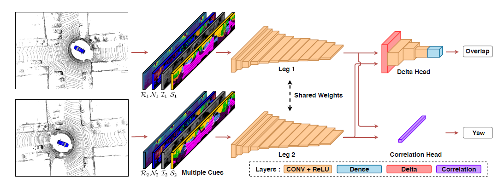
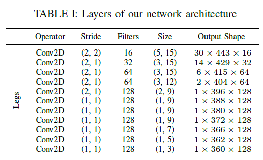
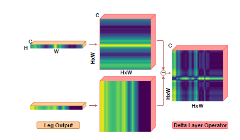
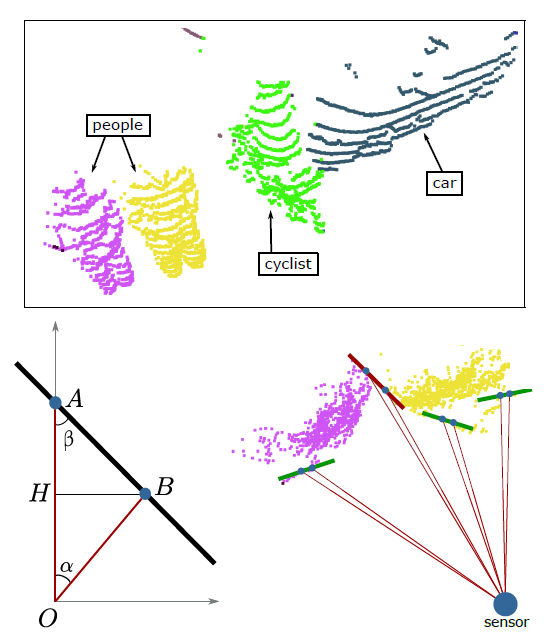
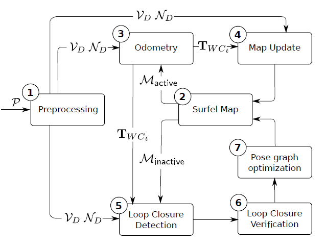

# [(2020 RSS)OverlapNet: Loop Closing for LiDAR-based SLAM](http://www.ipb.uni-bonn.de/wp-content/papercite-data/pdf/chen2020rss.pdf)

## 1 Summary
In this paper, the author proposed a new approach to detect the loop closures for SLAM based 3D laser scans. Unlike previous methods that use handcraft features, the author proposed a deep neural network to find loop closures using several cues generated by the laser scan. To evaluate the performance of the network, the author trained and tested the model in the KITTI odometry dataset and found it surpasses state-of-art detection method. Furthermore, to evaluate the generalization of the network, the author using the model trained in KITTI dataset and tested it in the Ford campus dataset and showed it performs well when in unknown environments.

## 2 Challenge
Loop closure detection is a classic problem in robot mapping. There have been a large number of works towards image-based SLAM. However, LiDAR-based SLAM is a novel topic and it has some difficulties to use traditional methods. The main challenge in LiDAR SLAM is the the raw point data is sparse and expensive to compute with.

## 3 Main Idea

### 3.1 Criterion of Loop Closures

In this paper the author use tradition measurements, overlap as the criterion to determine whether two images are from the same position. The overlap is calculated according to the percentage of number of points in the first image that can be projected to the second image. Specifically, to obtain the overlap, two different raw point cloud first need to be projected two a 2D vertex map for further analysis. Different maps are then transformed in the same coordinate frame using their pose information. Then we can calculate the overlap using the following formulation:

$$
O_{C_1, C_2} = \frac{\sum_{(u, v)} II \{ ||V_1(u, v) - V_2(u, v)|| < \epsilon \}}{\min(valid(V_1), valid(V_2))}
$$

Because not all pixels the vertex image are effective, the denominator of the formulation is the minimum of the valid pixels of the two images. In the formulation, V is the generated vertex map and $\epsilon$ is the threshold to determine whether two pixels are originated from the same real world point.

### 3.2 OverlapNet Architecture

The architecture of the OverlapNet can be seen as a siamese network. The network uses several cues such as intensity, range, normal .etc as the different input channels which makes the dimension of input to be $64 \times 900 \times D$ where D is the number of dimensions.  
The OverlapNet consists of two legs sharing weights and two heads that use the same pair of feature volumes generated by the two legs.

1. Legs: the leg layer is a light-weight full convolution network. it extracts a $1 \times 360 \times 128$ feature map from each input tensor. The detail architecture is listed in the table below:

2. Delta Head: the delta head is used to estimate the overlap using the feature maps generated in the legs. The main component in the delta head is the delta layer which compute the absolute difference between any two pixels in the two images. To perform the task, it first expand the two feature maps in different dimension. The subtraction of the two expanded matrix can represent all the difference between two images. 

3. Correction Head: the correction head is mainly used to estimate the yaw angle. In this layer one feature map is expanded as twice in width and the other slide over the expanded map to obtain the raw angle.

## 4 Strength

1. The idea to use convolution neural network to predict the overlap and raw angle.
2. The design of its loss function.

## 5 Weakness
1. The proposed method is not robust to inclined walls.

# [(2016 IROS)Fast Range Image-Based Segmentation of Sparse 3D Laser Scans for Online Operation](https://www.ipb.uni-bonn.de/wp-content/papercite-data/pdf/bogoslavskyi16iros.pdf)

## 1 Solved Problem
In this paper, the author proposed a 3D laser scans segmentation algorithm that divides the original points cloud in two different objects. By converting the 3D scans to 2D image, the algorithm can obtain real-time segmentation.

## 2 Main Idea
The basic problem needed to be solved in the object segmentation is if two neighboring points are originated from the same object. To solve this problem, the author propose a threshold-based method.

The top picture is the original point cloud and the picture in the bottom-right is its top-down-view. The bottom-left picture shows the basic idea of the algorithm. In this picture the angle between the further beam and the connection between two adjacent beams is denoted as $\beta$. Intuitively, the angle is large is the difference between the distance of A and B is small. So we can set a threshold $\theta$ that when the angle $\beta$ is larger than $\theta$ then we consider the two points come from different objects.  
The divide the full laser image to different objects the author used a BFS algorithm to find every connected components in the image. The algorithm has a complexity of $O(n)$.

## 3 Highlights Worth Learning

1. The idea to use the angle $\beta$ as the measurement of segmentation.
2. Use a 2D image rather than the original point clout to accelerate the computation.

# [(2018 RSS)Efficient Surfel-Based SLAM using 3D Laser Range Data in Urban Environments](http://roboticsproceedings.org/rss14/p16.pdf)

## 1 Solved Problem
In this paper, the author propose a surfel-based mapping algorithm that construct the dense map compared to traditional feature-based method in LiDAR SLAM. Furthermore, the author also devised a novel loop closure detection algorithm that can detect loop closing even the overlap is small between the scan and the rendered view from the model.

## 2 Main Idea

The pipeline of the algorithm is shown in picture above. In the preprocessing module, the raw point cloud is transformed to a vertex map and its corresponding normal map. In the up side of the picture, the two maps are used to calculate the transformation $T_{WC}$ and then update the surfel model. In the down side of the picture, it is used to perform loop closure detection.  
The surfel representation plays a central role in the algorithm. In a surfel map, each surfel is represented by a position, a normal and a radius. All of the surfels consists of an unordered set.

## 3 Highlights Worth Learning

1. The idea to transfer dense mapping in image-based SLAM to the LiDAR SLAM region.
2. Use vertex map to reduce computation cost.