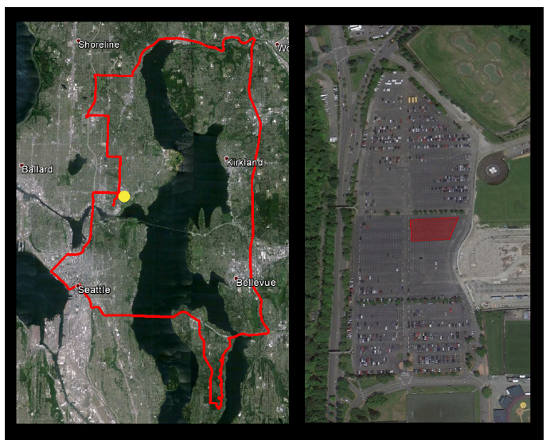
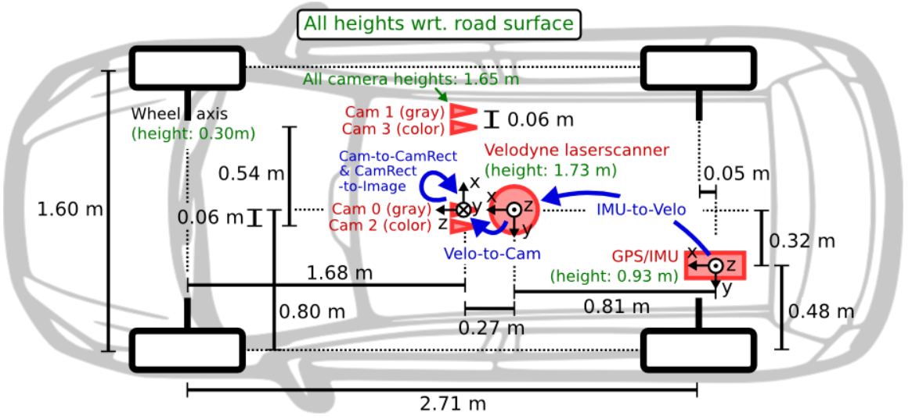

# [(2020 SP)I Know Where You Parked Last Summer: Automated Reverse Engineering and Privacy Analysis of Modern Cars](https://ieeexplore.ieee.org/stamp/stamp.jsp?tp=&arnumber=9152789)

## 1 Summary
Recently, with the development of electronic technologies in modern cars, the perspective to seem a vehicle as a pure mechanical device is out-of-date. But these Electronic Control Units(ECUs) also collect diverse information from the vehicles and transmit them to the cloud. Because of the secret nature of the automotive industry, the format of its transmission protocol can't be found from the OEM or any other third-party organizations. In this paper, the author proposed a new tool, AutoCAN for privacy and security analysis that reveals what data cars collect by tapping into in-vehicle network. Furthermore, the algorithm proposed in independent to the specific physical and link layer protocols.

## 2 Challenge
Reverse-engineering in-vehicle network has some difficulties out of its closed source.
* One can't determine whom a message from and to be received. The CAN protocol broadcasts on the bus and uses only one single id to denote its source, which may be shared by multiple ECUs.
* Because of the broadcast mechanism, one can't draw the data flow between relevant ECUs.
* A frame may transfer multiple signals, which differs from frame to frame.

## 3 Main Idea

### 3.1 Assumptions
In this paper, the author focus on the scenarios where the attackers only have access to the in-vehicle network and so doesn't need the physical access.
It is also assumed that the attackers don't have any prior knowledge about the application layer protocol, which is proprietary to each company and doesn't has any document on the Internet. The main goal of this paper is to get the syntax and semantics information of the payload of a CAN bus message.

### 3.2 Methodology
The payload of the CAN bus messages have distinct formats between different companies. But each of them are consists of several signals, the main goal of this paper is to find out the layout of the signals. The following picture show a typical structure of a payload.

The basic idea of this paper is to first group different messages according to their ids. After classify the messages, a greedy search algorithm is used to segment the payload according to the possibility of the type of the field. In this end, the authors use correlation analysis to distinguish different singals which are related strongly. This may be helpful to label the signal.

### 3.3 Segmentation

The segmentation algorithm utilize the fact that the manufacture always compresses the bits one signal occupies. So the authors use a greedy search algorithm which start from the length 0 and increase iteratively until inconsistency happened. Concretely, let $f(z, i, j)$ denote the signal start from the $i_{th}$ index and has a length of j, the frame id of it is z. We also need a plausibility function which return the corresponding categories of the current signal.

$$
s = f(z, i, j), y = P(s)
$$

In each iteration it increase the length by one:

$$
s^{'} = f(z, i, j + 1),  y^{'} = P(s^{'})
$$

If $y = y^{'}$, the it repeats the process, otherwise it stop the search and start a new search at position j.

### 3.4 Plausibility analysis

At first, the authors identify four different patterns of the signal as the picture shown below:

1. Continuous. Just a simple numeric unsigned value, such as the speed.
2. Psesudo-random. The value generated randomly, such as checksum.
3. Enumeration. The value which is constrained to several particular values, such as the status of the door.
4. Cyclic. The value that repeats periodically.

Each signal in the payload can be categorized to one of the four kinds. To perform this process, the author use several metrics such as autocorrelation, hamming distance distribution and post-hamming distance distribution. These metrics both utilize the different behaviors of the four types.

### 3.5 Correlation analysis.

The measurement from one sensor and another sensor may have strong correlation such as the value of the speed sensor is the first derivative of the distance. If we can identify such correlation, we can use existing label knowledge to infer another type of signal.

To identify the relation as much as possible, the author compute the Pearson correlation coefficient between each pair of signal and cluster signals with a coefficient value that is larger the 0.8. The picture below show the result of the analysis.

## 4 Strength
1. The method proposed doesn't need to get a real car which decrease the cost of research
2. Using the network traffic that is easy to get to peek the CAN bus messages

## 5 Weakness
1. Can't get semantics information without prior knowledge.
2. The organization of this paper is quite confused.

# [(2016 PoPETs) Automobile driver fingerprinting](https://content.sciendo.com/downloadpdf/journals/popets/2016/1/article-p34.xml)

## 1 Solved Problem
Today's autonomous vehicles leverage powerful sensors to optimize efficiency and safety. However, it also increases the danger of information leakage. So, In this paper, the authors attempt to identify individuals using the messages on CAN bus. With 15 participants on 2 typical driving scenarios, the author found that at least it can get almost 100% accuracy with a small number of candidates and the accuracy increase with the increment of available data.

## 2 Main Idea
In this paper, the authors use four different machine learning classifiers, KNN, Random Frost, SVM and Naive bayes. To obtain training data, the authors logged data from 16 sensors and 15 drivers in two types of road, as the picture depicted below:

1. Three laps around a closed-course section.
2. Around 50 miles of open road driving.

After some signal processing and feature extraction procedure, the author evaluate the possibility of identification by changing the amount of data the classifier can get.

## 3 Highlights Worth Learning
1. Use CAN bus messages and machine learning to fingerprint drivers.
2. Find sense in the opaque between users and manufactures.

# [(2012 CVPR) Are we ready for Autonomous Driving? The KITTI Vision Benchmark Suite](http://www.webmail.cvlibs.net/publications/Geiger2012CVPR.pdf)

## 1 Solved Problem

In this year, visual recognition systems are rarely deployed in robotic applications, one important reason for this is the lack of benchmark standard. In this paper, the author proposed a new dataset for tasks of stereo, optical flow, visual odometry, SLAM and 3D object detection with benchmarks around each task.

## 2 Main Idea

Compared to previous in-door dataset, the authors capture data in the real scenarios with an autonomous driving platform. 

Specifically, the authors drive a car in a mid-size city and capture the measurement from sensors such as camera and LiDAR. The car used is equipped with two high resolution stereo camera system, a Velodyne HDL-64E laser scanner and a state-of-art OXTS RT 3003 localization system. To use these data as benchmark, the author also provide ground truth to each task.

## 3 Highlights Worth Learning
1. Propose a widely accepted benchmark in autonomous driving algorithms.