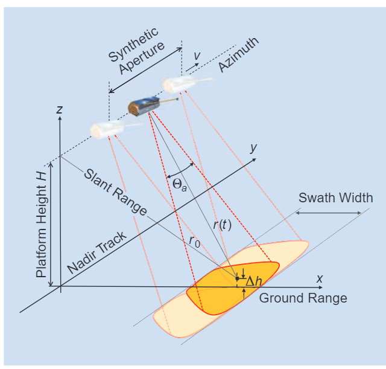
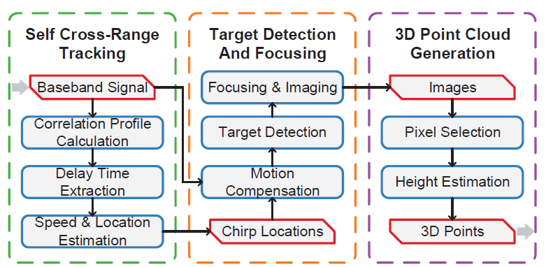
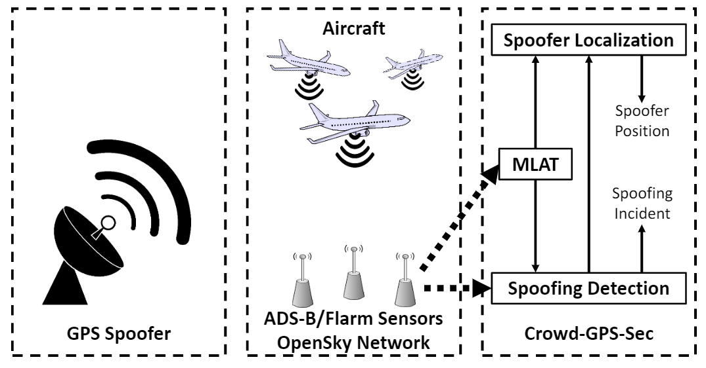

# [(2021 Ubicomp)3D Point Cloud Generation with Millimeter-Wave Radar](http://xyzhang.ucsd.edu/papers/KQian_UbiComp21_RadarPointCloud.pdf)

## 1 Summary
Autonomous driving car relies heavily on the ability to percept the environment. However, current technologies used in AVs widely, such as camera and LiDAR, are vulnerable to weather condition. The Rader sensor doesn't has such limitation, but it can only get 2D perception in previous study, In this paper, the author proposed MILLIPOINT, which uses synthetic aperture radar to to construct 3D point clouds.

## 2 Challenge
The SAR technology appeared in the 1990s and has gotten huge success in airline and ship.  Despite the all-weather operations of Radar, there are several factors that constrain the application of Vehicle Radars.
* Aperture motion error: Tradition synthetic aperture radar require the Radar to move in a constant speed, which is impossible in the scene of roads.
* Specular reflection: The wavelength of mmWave is larger than the roughness of the surface, so the specular reflection is prone to happen.
* Height information: the objects' height are crucial in modern autonomous vehicles. However, the scatter points with the same cross-range and range values are in the same position in the final radar image.

## 3 Main Idea
### 3.1 Synthetic Aperture Radar
With the basic Radar theory, the resolution of Radar is proportional to the length of its antenna. So SAR is proposed to be a method that generates a virtual antenna using the movement of the Radar set. In a transmission cycle the radar scatter a chirp and move in a constant speed when waiting for the reception. After some signal processing steps, we can final get a Radar image in a much higher resolution. The picture below shows the basic process of SAR.

### 3.2 MILLPOINT Overview

The author proposed MILLPOINT that extends the SAR to provide 3D points cloud for autonomous vehicles. To achieve this goal, it has three main components, as the picture shown above.
* Self Cross-Range Tracking. Because MILLPOINT takes the sole baseband samples as its input. To utilize SAR, we must know the position and speed of the Radar.
* Target Detection And Focusing. MILLPOINT uses both the origin signal and the speed extimation to get the 2D image of the environment. In this step it must consider the specular reflection effect.
* 3D point generation. In this step, MILLPOINT uses the height extimation drived by the phase difference to construct the final 3D points cloud.

### 3.3 Self Cross-Range Tracking

The SAR need to obtain the distance that the vehicle moves between two consecutive pulses. However, other sensors, such as GPS, can't get a mm-level accuracy, which is required by the mmWave Radar. So, In this paper, the author tried to obtain the cross-range information by the Radar itself.  
To obtain this goal, the other utilize the fact that different  antenna pairs in different times may get the same reception signal but with a delay that relates to the speed of the car directly. This is because the environment is static when compared with the speed of the car. So the author uses cross-correlation between different antennas to estimate the speed of the car.

### 3.4 Target Detection and Focusing

The use of mmWave radar can let the movement of the car to be constant speed, but it also induce some troubles such as the specular reflection. 
To overcome this question, the author proposed a target-based method that divide the images to different target and construct the target individually to get the final image.

### 3.5 3D Point Cloud Generation

Traditional SAR can only generate 2D image. But the height information is always playing an important role in the application of autonomous driving.  
To solve this problem, the author utilize the observation that points in the same 2D position with a different height can be distinguished using the difference of their phases. After calculating the height information, we can finally fuse a 3D point cloud.

## 4 Strength

1. The singal processing steps and the thought behind them is worth-learning
2. Using 2D Radar to generate 3D point cloud
3. The Radar sensor is robust to some bad weather condition.

## 5 Weakness

1. Don't do experiments on the real vehicles

# [(2018 SP)Crowd-GPS-Sec: Leveraging Crowdsourcing to Detect and Localize GPS Spoofing Attacks](https://pulverturm-zofingen.ch/assets/downloads/pdf-und-powerpoint/GPS%20Schutz.pdf)

## 1 Solved Problem
In this paper, the author proposed a novel algorithm to detect and localize the GPS spoofing attack which is severe to airborne and UAVs. Compared other methods devised before, this algorithm doesn't require to modify the GPS satellite and receiver.

## 2 Main Idea

The Crowd-GPS-Sec is based on the crowdsourcing to detect and localize the spoofing attack.

As the picture above, the Crowd-GPS-Sec has three main components.
1. MLAT. The MLAT module estimate the location of the aircraft using the time difference of arrival of position advertisements between different sensors in OpenSky network.
2. Spoofing Detection. To detect the existence of GPS spoofing, the author mainly compare the difference between the position drived by the GPS signal and the crowdsourcing network. Simultaneously, the author also considered the situation where two aircraft report the same location.
3. Spoofing detection. To determine the position of the spoofer, the author compare the received position in advertisements and the true position estimated by the MLAT. 

## 3 Highlights Worh Learning
1. The use of multilateration to drive the true position of aircraft.
2. Using OpenSky network to obtain information
3. The thought to enhance current GPS system without any modification to them.

# [(2018 ECCV)3D Bounding Boxes for Road Vehicles: A One-Stage, Localization Prioritized Approach using Single Monocular Images.](http://openaccess.thecvf.com/content_ECCVW_2018/papers/11133/Gupta_3D_Bounding_Boxes_for_Road_Vehicles_A_One-Stage_Localization_Prioritized_ECCVW_2018_paper.pdf)

## 1 Solved Problem
In this paper, the author proposed a 3D bounding-box algorithm that generate a bounding box for each object using a monocular image merely. To achieve this goal, it must generate accuracy height estimation using monocular images.

## 2 Main Idea

Compared to prior researches, the author innovate them in a few aspects. At first, the author regraded the center of the bottom face(CBF) as the key point and predict it before all the other prediction. Then it uses Inverse Perspective Mapping on the center of the bottom edge of the 2D bounding box to find the corresponding location in the world coordinates. Finally, the author uses a look-up table method to reproject the center to the 3D world.

## 3 Highlights Worth Learning

1. Use monocular image to estimate height information.
2. Te use of IPM.
