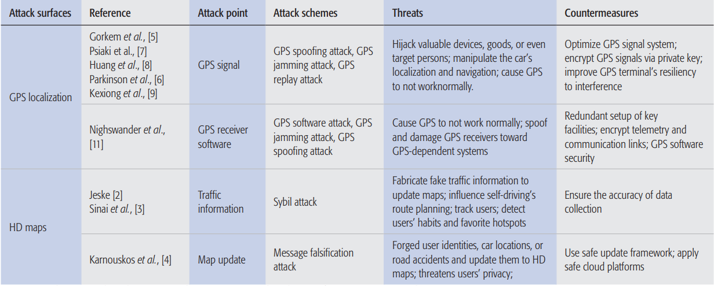

# (2019 Wireless Communication)Localization and navigation in autonomous driving: Threats and countermeasures

## 1 Solved Problem

The paper contains two major parts.
+ In the first part the authors make a comprehensive survey toward security vulnerabilities in today's state-of-art navigation and localization technologies.
+ In the second part, the authors devise a novel route spoofing attack by injecting malicious code to modify the parameter of the route planning function in navigation apps.

## 2 Main Idea

The authors first construct a taxonomy about different attacks on localization and navigation system. The main components in these two systems are GPS and HD map. So, the authors classify different attacks base on their target component. For each sort of attack, the authors also discuss the countermeasures toward it.

After investigating current attack methods the authors conduct their own route spoofing attack and prove them to be effective to the most popular navigation applications.  
The basic Idea in the attack is trying to change the parameters of the route planning functions(i.e. the staring, destination and waypoint positions). To achieve this 